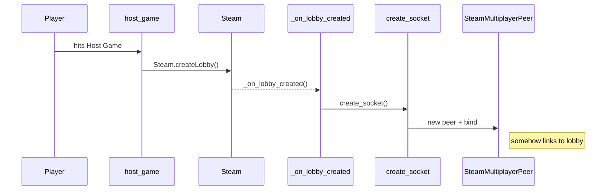

# multiplayer
## host
how it works
1. players hits host hame
2. host game calls host_game
3. host_game calls Steam.createLobby
4. once steam has created the lobby, it callsback to _on_lobby_created
5. _on_lobby_created then calls create_socket
6. create_socket then activates SteamMultiplayerPeer which creates a new multiplayer peer and binds it
   1. this *somehow* links to the lobby, no idea how

issue: Supplied MultiplayerPeer must be connecting or connected
## join

